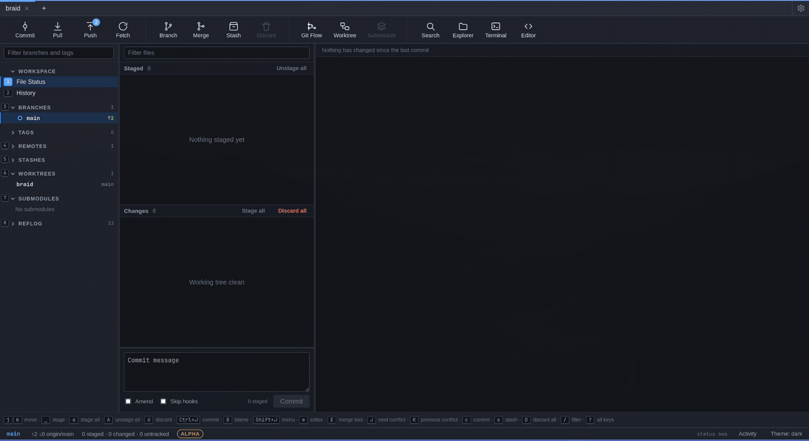
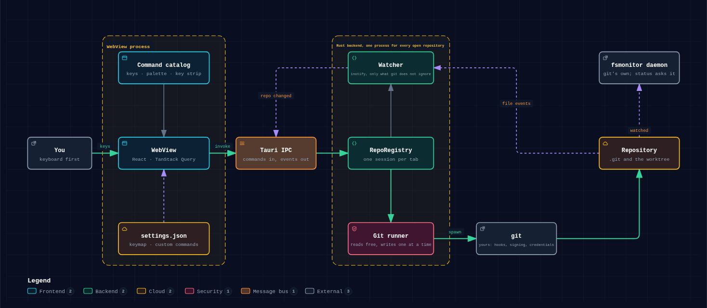

# Braid


A fast, keyboard-first Git GUI.

Built because SourceTree becomes unusable with several repositories open at once.



> **Alpha.** Usable daily, but early. Every write goes through your own `git`, so
> nothing here invents a storage format of its own — but keep a backup of anything
> you cannot afford to lose, and expect rough edges.

See [PLAN.md](./PLAN.md) for the architecture, the performance rules the design
is built around, and the phased roadmap.

## Architecture



Keys reach a React WebView, which talks to one Rust process over Tauri IPC.
That process holds a session per open repository: a watcher on the
directories git does not ignore, and a git runner that lets reads through
freely and writes one at a time. Every write is your own `git`, so hooks,
signing and credential helpers behave as they do in your terminal. Changes
come back as events, never by polling.

The diagram is [`docs/architecture.archify.json`](docs/architecture.archify.json),
rendered with [archify](https://github.com/tt-a1i/archify).

## Status

The layout follows SourceTree deliberately: repo tabs, an icon toolbar, a
sidebar of Workspace / Branches / Tags / Remotes / Stashes / Worktrees /
Submodules, and a File Status screen with staged above unstaged and the diff
to the right.

Working today:

- Several repositories open at once, as tabs
- Live working-copy status driven by filesystem events (never polled)
- Stage / unstage / discard by file, whole-section toggles, commit with amend
- Unified diff viewer, virtualized, with binary and oversize-file handling
- History browser, paged and virtualized, with commit details
- Branches, tags, remotes, stashes; fetch, pull, push, merge, rebase, cherry-pick, checkout
- Worktrees: list, add, remove, prune, and open any worktree as its own tab
- Submodules: state per submodule, init/update, and open one as its own tab
- Light, dark, and follow-the-system themes

Not built yet: branch lanes in the history graph, hunk and line staging,
conflict resolution, command palette. Those are Phases 3–5 in the plan.

## Running the Linux AppImage

It mounts itself with FUSE 2, which several distributions no longer install by
default — Fedora, Arch and Ubuntu 24.04 among them. Without it the app exits
with `No suitable fusermount binary found on the $PATH`. Install whatever
package provides `/usr/bin/fusermount`: `fuse2` on Arch, `fuse` on Fedora,
`libfuse2` on Debian and Ubuntu (`libfuse2t64` from 24.04 on). FUSE 3 alone is
not enough — that is `fusermount3`, a different program.

Or skip the mount, at the cost of a slower start:

```sh
./Braid.AppImage --appimage-extract-and-run
```

It is built on Ubuntu 22.04, so it needs a distribution from 2022 or later.
Debian 11, Ubuntu 20.04, RHEL 9 and openSUSE Leap 15 are too old for it.

## Requirements

- Rust (stable) and the MSVC toolchain
- Node 20+ and pnpm
- Git 2.37 or newer, for the built-in filesystem monitor

## Development

```sh
pnpm install
pnpm tauri dev
```

```sh
pnpm build                                   # typecheck + build the frontend
pnpm test                                    # frontend unit tests
pnpm tauri build                             # release binary + installer

cargo test  --manifest-path src-tauri/Cargo.toml   # all Rust tests
cargo clippy --manifest-path src-tauri/Cargo.toml --all-targets
```

## Tests

Two kinds, and the difference matters.

**Unit tests** live beside the code and cover the parsers, the patch builder and
path handling. They run against strings written by hand, which proves the logic but
says nothing about whether git actually produces that shape.

**Integration tests** in `src-tauri/tests/` close that gap. Each one creates a real
repository in a temporary directory, drives it with real git, and reads the result
back through the same functions the app calls. They cover status in every state,
diffs, hunk and line staging, history and refs, commit detail, merge and rebase
conflicts, worktrees, submodules and git flow.

Each test repository sets its own `user.name`, `user.email` and disables signing, so
the suite does not pass or fail depending on whose machine it runs on. They use
`Git::plain` rather than `Git::new`, because `core.fsmonitor` starts a daemon that
holds a handle to the worktree and would stop the test deleting its own repository
on Windows.

## Benchmarks

```sh
pnpm bench:generate     # synthetic repositories, via git fast-import
pnpm bench              # medians per git call
```

These measure git's own cost on the machine, not the app — see PLAN.md section 6,
which records the first results and one claim of ours they did not support.

## The icon

`src-tauri/icons/braid.svg` is the source of truth. It draws the same thing
the history view does — a trunk, a lane that diverges and merges back, and a
hollow ring for the merge — using the same curve construction as
`CommitGraph.tsx`, so the mark and the app agree.

To change it, edit the SVG and regenerate:

```sh
node scripts/icon.mjs                          # SVG -> icons/source.png
pnpm tauri icon src-tauri/icons/source.png     # source.png -> .ico, .icns, PNGs
```

Check the result at 32px before committing. The proportions are tuned for that
size: the branch's parallel run has to carry about a third of its length, or the
two curves meet and the shape closes into a balloon.

## Releasing

One command, then CI does the rest:

```sh
pnpm release patch          # or minor, major, or an exact 1.4.2
git push && git push origin v0.1.1
```

The script bumps the version in the three files that have to agree
(`package.json`, `tauri.conf.json`, `Cargo.toml`), commits, and tags. Pushing the
tag starts `.github/workflows/release.yml`, which builds installers for Windows,
macOS and Linux, signs the update artifacts, and opens a **draft** release with a
`latest.json` manifest attached.

It stops at draft deliberately. Nothing installed offers the update until you open
that draft and publish it, so a tag pushed by mistake costs nothing.

```
pnpm release alpha      0.1.0-alpha.1 -> 0.1.0-alpha.2
pnpm release beta       0.1.0-alpha.4 -> 0.1.0-beta.1
pnpm release stable     0.1.0-alpha.4 -> 0.1.0
pnpm release patch|minor|major
pnpm release 1.4.2      an exact version
```

`--dry-run` shows what it would change without writing anything.

### Prereleases and the updater

A prerelease is signalled by the **version** (`0.1.0-alpha.2`), which the app reads
at runtime and shows as a badge beside the status bar, on the welcome screen and in
*Settings → About*. Because it is derived from the version, the badge disappears by
itself at 1.0.0 rather than waiting for someone to remember to delete it.

GitHub's own *prerelease* checkbox is deliberately left **off**, and this is the one
non-obvious thing in the setup: GitHub excludes prereleases from
`/releases/latest`, which is exactly the URL every installed copy polls. Ticking it
would quietly switch off auto-updates for everyone. Turn it on in
`.github/workflows/release.yml` only once updates no longer matter, or after moving
the endpoint off `/latest`.

### First-time setup

Two things have to be done once, and updates silently do nothing without them.

**1. Point the updater at the repository.** In `src-tauri/tauri.conf.json`, replace
`OWNER/REPO`:

```json
"endpoints": ["https://github.com/OWNER/REPO/releases/latest/download/latest.json"]
```

**2. Add the signing key to GitHub.** Updates are signed, and the app refuses
anything not signed with the key its build was made against. The keypair already
exists at `~/.tauri/braid-updater.key`; the public half is in `tauri.conf.json`
and the private half must never be committed.

In *Settings → Secrets and variables → Actions*, add:

| Secret | Value |
| --- | --- |
| `TAURI_SIGNING_PRIVATE_KEY` | the contents of `~/.tauri/braid-updater.key` |
| `TAURI_SIGNING_PRIVATE_KEY_PASSWORD` | empty, unless you set one |

**Back that private key up somewhere you will still have it in a year.** Losing it
means every installed copy stops accepting updates, because they only trust that
key — the only way out is for everyone to reinstall by hand.

### How an installed app updates

A few seconds after launch it asks GitHub whether a newer release exists, and shows
a banner under the toolbar if so. Nothing downloads until asked, and nothing
restarts without asking — an update that interrupts you mid-commit is worse than a
late one. It can also be checked on demand in *Settings → Updates*, and the
launch check turned off there.

## Custom commands

Your own commands live in the settings file, under `customCommands`, the way
lazygit's do. Open the file from Settings, Commands, Edit the settings file.

```json
{
  "customCommands": [
    {
      "label": "Open pull request",
      "command": "gh pr create --web --head {{branch}}",
      "context": "branch"
    },
    {
      "label": "Run the tests",
      "command": "pnpm test",
      "context": "global",
      "key": "Shift+T"
    },
    {
      "label": "Push a branch to a remote",
      "command": "git push {{prompt.remote}} {{head}}",
      "context": "global",
      "prompts": [{ "key": "remote", "label": "Remote", "options": ["origin", "upstream"] }],
      "confirm": "Push {{head}} to the remote you pick?"
    }
  ]
}
```

A command shows up where its context says: `global` ones in the command
palette and on their key, the rest in the right-click menu of a branch,
commit, file, remote, stash or tag, and on Shift+Enter over the row. The line
runs through the shell in the repository's root, `sh` on Linux and macOS and
`cmd` on Windows, and its output goes to the activity log.

Placeholders: `{{branch}}`, `{{commit}}` with `{{short}}` and `{{subject}}`,
`{{file}}`, `{{remote}}` with `{{url}}`, `{{stash}}`, `{{tag}}`, and always
`{{head}}` for the checked-out branch and `{{repo}}` for its path. A prompt's
answer is `{{prompt.key}}`. Changes to the file are read at the next launch.

## Notes on behaviour

**Reads and writes take different paths.** Writes shell out to your own `git`,
so hooks, credential helpers, GPG signing, LFS and `.gitconfig` behave exactly as
they do in your terminal. Reads currently do too, and will move to gitoxide once
the benchmark harness can show the difference.

**Your git config is never modified.** The performance settings this app relies
on (`core.fsmonitor`, `core.untrackedCache`) are passed per-invocation with
`-c`. Enabling fsmonitor does start git's own background daemon for a repo; it
exits on its own when idle.

**Nothing polls.** Status refreshes come from a filesystem watcher, debounced,
with `.git/objects`, `node_modules` and similar noise filtered out. An idle repo
costs no CPU, which is what makes many open tabs viable.
